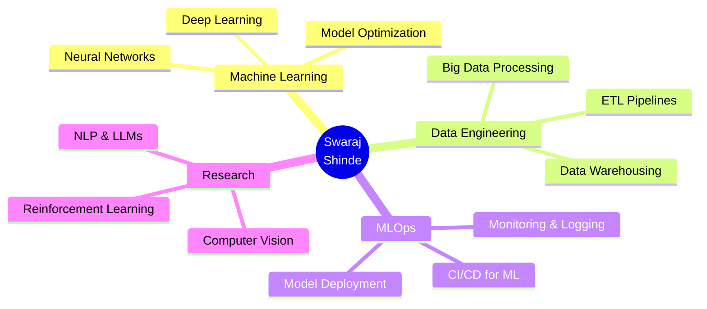

<div align="center">

# 👨‍💻 Swaraj Shinde


[](https://linkedin.com/in/swaraj-shinde-3b8631223)
[](https://github.com/swarajshinde12)
[](https://github.com/swarajshinde12)

</div>

---

## 🚀 About Me


```python
class DataScientist:
    def __init__(self):
        self.name = "Swaraj Shinde"
        self.role = "Data Science Engineer"
        self.location = "Mumbai, India 🇮🇳"
        self.language_spoken = ["en_US", "hi_IN", "mr_IN"]
        
    def say_hi(self):
        print("Thanks for dropping by! Let's innovate together.")
        
    def current_work(self):
        return {
            "focus": ["ML/AI Solutions", "NLP", "Computer Vision"],
            "learning": ["Advanced Deep Learning", "MLOps", "LLMs"],
            "collaborating": ["Open Source Projects", "Data Science"],
            "tools": ["PyTorch", "TensorFlow", "Scikit-learn"]
        }

me = DataScientist()
me.say_hi()
```

### 💡 What I Do

- 🔬 **Build & Deploy ML Models** that solve real-world problems
- 📊 **Transform Raw Data** into actionable business insights
- 🤖 **Develop AI Solutions** using cutting-edge techniques
- 🎯 **Optimize Algorithms** for performance and scalability
- 📚 **Continuous Learning** in AI/ML landscape

---

## 🛠️ Technology Arsenal

<div align="center">

### 💻 Programming Languages


### 🧠 Machine Learning & AI


### 📊 Data Science & Analytics


### 🗄️ Databases


### ☁️ Cloud & MLOps


### 🔧 Tools & Frameworks


</div>

---

## 📊 GitHub Analytics

<div align="center">
  
  
</div>

<div align="center">
  
</div>

<div align="center">
  
</div>

---

## 🏆 GitHub Achievements

<div align="center">
  
</div>

---

## 💼 Featured Projects

<div align="center">

<a href="https://github.com/swarajshinde12/Text-Classification-from-Scratch">
  
</a>

<a href="https://github.com/swarajshinde12/image-captioning-and-similarity-generator">
  
</a>

</div>

---

## 📈 Coding Activity

<!--START_SECTION:waka-->
<!--END_SECTION:waka-->

<div align="center">
  
</div>

---

## 🎯 Current Focus

<div align="center">



</div>

---

## 💭 Random Dev Quote

<div align="center">


</div>

---

## 🐍 Contribution Snake

<div align="center">
  
</div>

---

## 📫 Let's Connect!

<div align="center">

[](https://linkedin.com/in/swaraj-shinde-3b8631223)
[](https://github.com/swarajshinde12)
[](mailto:swarajshinde@example.com)
[](https://twitter.com/swarajshinde12)
[](https://swarajshinde.dev)

</div>

---

<div align="center">

### 💡 "The best way to predict the future is to invent it." - Alan Kay


### ⭐ If you find my work interesting, consider giving it a star!

**Made with ❤️ and lots of ☕**


</div>

---

<div align="center">
  
**© 2024 Swaraj Shinde | Building the Future with Data & AI**

</div>
